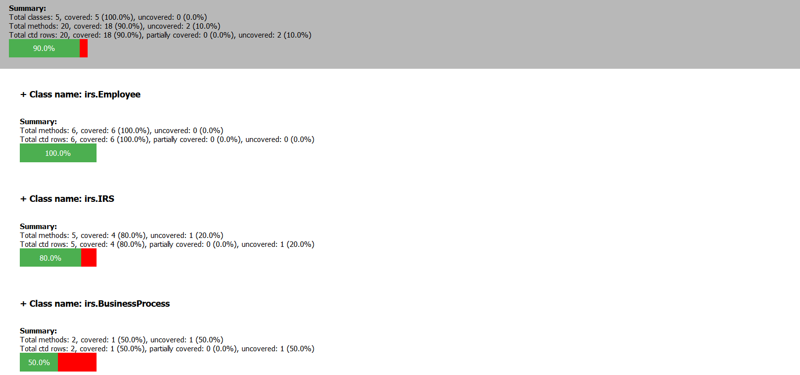
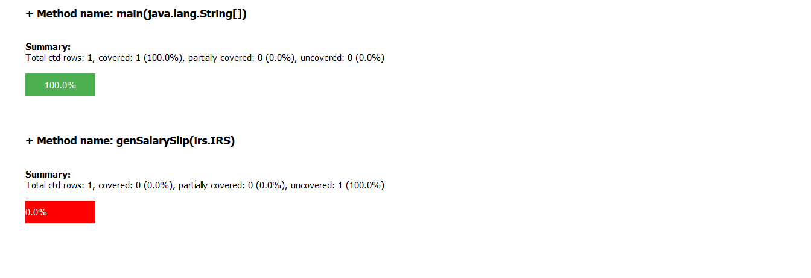
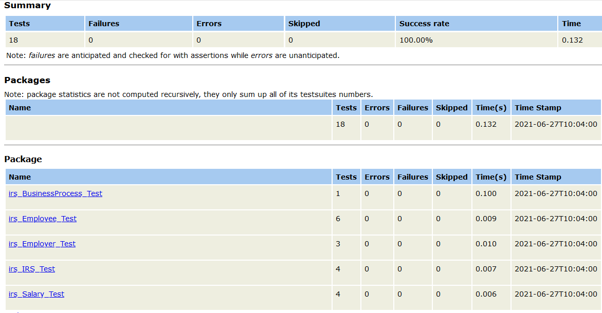
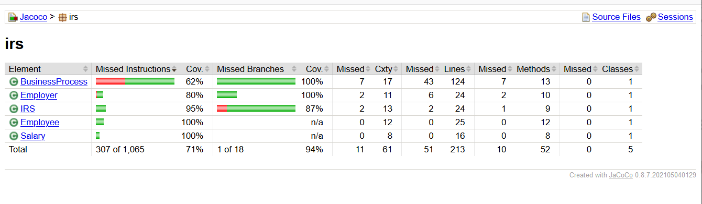

# TackleTest-Unit User Guide

1. [Overview](#overview)
2. [Test Generation](#test-generation)
3. [Test Execution](#test-execution)
4. [Best Practices and Troubleshooting Tips](#best-practices-and-troubleshooting-tips)
5. [Configuration Options](tkltest_unit_config_options.md)

## Overview

TackleTest-Unit provides automated test-generation capability for Java unit
testing. The core test generator that the CLI invokes resides in the related
[tackle-test-generator-core](https://github.com/konveyor/tackle-test-generator-core) repository.

The tool is integrated with two automated unit test-generation tools for Java: 
[Randoop](https://randoop.github.io/randoop/) and [EvoSuite](https://www.evosuite.org/). So tests can be
generated using either of these tools standalone or in combination with CTD modeling, which generates
test cases guided by a different coverage criterion that exercises methods based on combinations of different
types of method parameters. The goal of CTD-guided test generation is to exercise a method with different
combinations of subtypes of the declared types of the method parameters. To do this, the test generator creates
a CTD model for each method by identifying  possible subtypes of each method parameter type using class-hierarchy
analysis and rapid type analysis. From this  model, a CTD test plan is generated for a given interaction level;
the rows in the test plan become  coverage goals for the test generator. This type of test generation puts
emphasis on type interactions (or type-based testing), and applying CTD modeling enables the interaction levels
to be controlled as well  as optimizes the number of coverage goals (and resulting test cases) at an interaction level.

`tkltest-unit` also lets tests to be generated with or without assertions. In the case of EvoSuite and Randoop,
the assertions are generated by those tools. In the case of CTD amplification, differential assertions are
added by the test generator on states of objects observed during in-memory execution of test sequences.
Addition of assertions to tests makes the tests stronger in detecting behavioral differences between
two application versions, but it can also result in some false failures when expected differences in program state
occur between the versions. If assertions are not added, the only differences detected by the test cases
are those that cause the application to fail with runtime exceptions.

The core capability provided by the CLI is automated generation of unit test cases for Java classes. The tests can be generated using different tools/strategies, and with or without assertions. The generated tests can be executed in different ways: (1) via the CLI, (2) using `ant`, `maven` or `gradle`, or (3) in an IDE.

`tkltest-unit --help` shows the available commands and options for generating and running test cases.

```
usage: tkltest-unit [-h] [-cf CONFIG_FILE] [-l {CRITICAL,ERROR,WARNING,INFO,DEBUG}] [-td TEST_DIRECTORY] [-rp REPORTS_PATH] [-vb] [-v] [-offli] [-bt {ant,maven,gradle}] {config,generate,execute} ...

Command-line interface for generating and executing Java unit test cases

positional arguments:
  {config,generate,execute}
    config              Initialize configuration file or list configuration options
    generate            Generate test cases on the application under test
    execute             Execute generated tests on the application version under test

optional arguments:
  -h, --help            show this help message and exit
  -cf CONFIG_FILE, --config-file CONFIG_FILE
                        path to TOML file containing configuration options
  -l {CRITICAL,ERROR,WARNING,INFO,DEBUG}, --log-level {CRITICAL,ERROR,WARNING,INFO,DEBUG}
                        logging level for printing diagnostic messages
  -td TEST_DIRECTORY, --test-directory TEST_DIRECTORY
                        name of root test directory containing the generated JUnit test classes
  -rp REPORTS_PATH, --reports-path REPORTS_PATH
                        path to the reports directory
  -vb, --verbose        run in verbose mode printing detailed status messages
  -v, --version         print CLI version number
  -offli, --offline-instrumentation
                        perform offline instrumentation of app classes for measuring code coverage (default: app classes are instrumented online)
  -bt {ant,maven,gradle}, --build-type {ant,maven,gradle}
                        build file type for compiling and running the tests: ant, maven, or gradle
```

In the rest of the guide, we provide detailed description of the test-generation and test-execution capabilities, along with explanation of various configuration options that control the behavior of the CLI and the core test-generation engine.

## Test Generation

Unit test generation is supported by the `tkltest-unit generate` command. Currently, the supported sub-command of
`generate` is `ctd-amplified`, which performs CTD modeling and optimization over application classes to
compute coverage goals, and generates test cases to cover those  goals. CTD-guided test
generation can leverage either Randoop or EvoSuite for generating  initial or building-block
test sequences that are then extended for covering rows in the  CTD test plan.

By default, this sub-command generates diff assertions and adds them to the generated test cases.
To avoid adding assertions, use the `-nda/--no-diff-assertions` option.

``` 
usage: tkltest-unit generate [-h] [-nda] [-pf PARTITIONS_FILE] {ctd-amplified,evosuite,randoop} ...

positional arguments:
  {ctd-amplified,evosuite,randoop}
    ctd-amplified       Use CTD for computing coverage goals
    evosuite            Use EvoSuite for generating a test suite
    randoop             Use Randoop for generating a test suite

optional arguments:
  -h, --help            show this help message and exit
  -nda, --no-diff-assertions
                        do not add assertions for differential testing to the generated tests
  -pf PARTITIONS_FILE, --partitions-file PARTITIONS_FILE
                        path to file containing specification of partitions
```

To perform test generation, the starting point is creation of the configuration file, containing options and values for configuring the behavior of test generation. This includes specifying the app under test, selecting the test-generation strategy, specifying assertion generation, and specifying time limits for test generation.

### Specifying the app under test

The specification of the app under test is provided using the following configuration parameters:

1. `app_name`: The name of the application being tested. The value provided for `app_name` is used as prefix in the names of files and directories created by the test generator. For example, the directories containing the generated tests and test reports have the prefix `<app_name>-` and the CTD test-plan file has the prefix `<app_name>_`. The app name should thus not contain characters that are invalid in file/directory names.

2. `monolith_app_path`: A list of absolute or relative paths to directories containing application classes. The specified paths are used as Java `CLASSPATH` for purposes of loading application classes for analysis and test generation.
   
3. `app_classpath_file`. The name of a text file containing all library dependencies of the app under test. The file should contain a list of jar files (using relative or absolute paths); for example, see the [irs classpath file](../test/data/irs/irsMonoClasspath.txt). 

    Alternatively, you can specify your Gradle, Ant or Maven build file and Tackle-Test will automatically collect the application's library dependencies and create the classpath file.  To do this, use the `generate` command options in the toml file:
   
   - For Gradle build file, specify `app_build_type` and `app_build_config_file`. `app_build_settings_file` is optional for specifying a settings file. For example with Gradle build file, see the [splitNjoin app build specification](../test/data/splitNjoin/tkltest_config.toml).
   
   - For Ant build file, specify `app_build_type`, `app_build_config_file`, and `app_build_target`. `app_build_settings_file` is optional for specifying a property file. For Ant, this feature is currently supported only for Java projects that use a single build file and declare dependencies between compilation tasks through the `depends` attribute or `antcall` tasks. There is no current support for declaring dependencies in the compilation process through `ant` tasks in the build file, or using multiple build files.
   
   - For Maven build file, specify `app_build_type` and `app_build_config_file`.

### Selecting the test-generation strategy

The CLI implements three strategies for test generation: CTD-guided test generation, test generation using EvoSuite standalone, and test generation using Randoop standalone; these strategies are selected via the `generate` subcommands `ctd-amplified`, `evosuite`, and `randoop`, respectively.

CTD-guided test generation constructs a CTD model of each public method in the specified application classes, and generates a test plan from the model, where each row in the test plan---specifying a vector of types for the method parameters---becomes a coverage goal for test generation. Applying CTD at the method level, thus, results in a set of test plans that guide test generation. The CTD model for a method consists of a set of types for each formal parameter of the method; these types are subtypes of the declared parameter type and identified statically via type inference. Test generation operates in two steps. First, the test-generation engine runs EvoSuite and/or Randoop to create a set of base test cases from which it mines "building-block" test sequences and adds them to a sequence pool. Next, it iterates over the CTD test plans, and attempts to synthesize a covering test sequence for each row of a test plan by creating objects/values of the types specified in a row, and reusing sequences from the sequence pool.

CTD-guided test generation can be configured using the following parameters:

1. `base_test_generator`: The base test generator to use for creating the building-block test sequences: the values can be `evosuite` (EvoSuite only), `randoop` (Randoop only), or `combined` (both Evosuite and Randoop).

2. `ctd_coverage`: A boolean flag indicating whether to create the CTD coverage report during test generation. The coverage report shows for each test-plan row, whether it is covered, partially covered, or uncovered. A test-plan row is _covered_ if the test-generation engine is able to create a sequence calling the target method with parameter types specified in the row. Conversely, a test-plan row is uncovered if the engine is unable to create a sequence for the row. Partial coverage can occur in cases where one of the types in a row (i.e., a formal parameter of the target method) is a collection, map, or array type. In such cases, test plan also specifies a set of types to be added to the collection/map/array. If the test-generation engine is able to create only a subset of these specified types, the synthesized test sequence _partially covers_ the test-plan row.
   
3. `interaction_level`: CTD interaction level for test-plan generation. This option specifies the value of _n_ for _n-way_ interaction coverage. For example, the value `2` for `interaction_level` results in pair-wise testing, in which all combinations of subtypes for each pair of method parameters are included in the test plan. Note that increasing the interaction level to higher values can make test-generation expensive as it can generate very large test plans that the test generator then has generate covering sequences for.

4. `augment_coverage`: A boolean flag for coverage-driven augmentation of the CTD test suite. To use this option, the value of `base_test_generator` must be `evosuite` or `combined`. When specified, the test generator adds to the CTD test suite each EvoSuite-generated test class that increases instruction or branch coverage achieved by CTD test suite. Test augmentation is done in two phases. In the first phase, the generator computes the coverage delta of each base test class over the coverage of the CTD test suite. In the second phase, it orders the coverage-contributing test classes in decreasing order of the (instruction + branch) coverage delta, and adds test classes one at a time if it increases coverage of the augmented test suite. This option can increase the coverage rate of the generated test suite significantly. However, it can also increase the test generation time because test augmentation involves a large number of test executions.

When CTD-guided test generation completes, it produces a coverage report summarizing the CTD test plans coverage it achieved. The report is available in json format (to be consumed by visualization tools), 
as well as in html format where the user can drill down from class to method to CTD test plan row level, as illustrated below on the irs example.

    
  

To generate tests using EvoSuite in a standalone manner, the CLI provides the `generate evosuite` command. In this case, tests are generated directly by EvoSuite (without any CTD modeling), and test generation can be configured on the coverage criteria to be used by EvoSuite:

- `criterion`: A list of coverage criteria to be used by EvoSuite; possible values are `LINE`, `BRANCH`, `EXCEPTION`, `WEAKMUTATION`, `OUTPUT`, `METHOD`, `METHODNOEXCEPTION`, `CBRANCH`, and `ALL`. For more details on EvoSuite, please see [EvoSuite documentation](https://github.com/EvoSuite/evosuite/wiki).

To generate tests using Randoop in a standalone manner, the CLI provides the `generate randoop` command. In this case, tests are generated directly by Randoop (without any CTD modeling), and test generation can be configured on whether error-revealing tests are generated:

- `no_error_revealing_tests`: A boolean flag indicating that error-revealing tests should be generated by Randoop. For details on error-revealing tests, please see the [Randoop user manual](https://randoop.github.io/randoop/manual/index.html#error_revealing_tests).

### Specifying the scope of testing

The CLI supports test generation to be performed on all application classes or on a given set of classes. To generate test cases on a specific set of classes, the `generate` command option `target_class_list` can be used.

- `target_class_list`: A list of fully qualified class names specified the classes to be targeted for test generation' by default, the list is empty, in which case all application classes (i.e., all classes that can be loaded from the paths specified as `monolith_app_path`) are targeted for test generation.

### Specifying assertion generation

Differential (diff) assertions can be automatically generated and added to the JUnit test cases. Diff assertion generation records the created object states for each executed statement of the test case on the legacy app. 
It then adds them as assertions right after the statement, to enforce the behavior observed on the legacy app also on any other version of the app on which the test cases will be executed. The final JUnit test cases hence contain `assertEquals` statements after each original statement of the test case that resulted in the creation of new objects. Diff assertion generation
is activated by default. It can be deactivated via the toml file option `generate.no_diff_assertions` or the flag `--no-diff-assertions` (short name: `-nda`).

### Controlling the time spent in test generation

The time taken in test generation can be controlled via a couple of options:

- `time-limit`: The value, specified in seconds, is the upper bound on the time spent generating tests for _each class_ of the application. This option applies to the generation of building-block test sequences for CTD-guided test generation and for standalone test generation using EvoSuite and Randoop. The default time limit is 10s per class. The value can be lowered to reduce the time taken by test generation (e.g., for large applications with hundreds of classes or if there is a limited time budget for testing), at the cost of potentially lower coverage. Conversely, the time limit can be increased to allow for longer exploration of each class, but coverage tends to plateau so increasing the time to high values (e.g., 100s) may not provide much benefit.

- `num_seq_executions`: The value specifies the number of executions to perform to determine the pass/fail status of generated sequences. These executions are also used for checking the consistency of recorded object states for creating assertions, so that flaky assertions on non-deterministic values can be avoided. This option applies to CTD-guided test generation only. By default, each sequence is executed 10 times. To lower the cost of test generation, fewer executions can be performed, keeping in mind that fewer executions can result in some flaky tests being generated. 

### Support for Java Enterprise Edition (JEE) applications

For a JEE application, unit testing might be more challenging because the application server is not running and not initializing required resources. Queries 
made by the business code for various external resources via JNDI might thus result in `NullPointerException`, causing the unit tests to fail and overall coverage decrease.
To avoid such unit test failures, the test generator provides some limited support for JEE applications, with mocking support for JNDI lookups and database operations. This feature is built leveraging EvoSuite's capability for JEE support which mocks a database as well as the `InitialContext` object via its specialized classloader and online bytecode instrumentation. 
By default, JEE support is disabled. Enabling JEE support is done via the `jee_support` option for the `generate` command. 

- `jee_support`: Boolean flag indicating whether to enable mocking support for some JEE features in the generated test cases.

In EvoSuite test generation, this option simply activates JEE support. In CTD-guided test generation, it operates as follows:
for every test sequence (generated for some CTD test plan row) that fails on the legacy app, before discarding it, an attempt is made to execute it 
using EvoSuite classloader and JEE support. If the sequence passes, it is kept as part of the final JUnit test cases in an `EvoSuite` JUnit test file
(that is, a JUnit test file for the relevant class under test, containing JUnit notations to use EvoSuite classloader and its JEE support). In Randoop test generation, there is no JEE support. Hence in this case the `jee_support` option is ignored. 

Note that the current level of JEE support is limited to the types of JEE operations supported by EvoSuite and can still result in low coverage on some classes.
For more details on EvoSuite's JEE support see [EvoSuite JEE paper](https://www.evosuite.org/wp-content/papercite-data/pdf/ssbse16_jee.pdf). 

## Test Execution

The CLI `execute` command automatically creates a build script to compile the test cases, execute them, 
and create JUnit and (optionally) code coverage reports. Different configuration options exist to control the
behavior of this command.

```
usage: tkltest-unit execute [-h] [-nbf] [-cc] [-tc TEST_CLASS]

optional arguments:
  -h, --help            show this help message and exit
  -nbf, --no-build-file-creation
                        whether to generate build files; if set to false, a build file (of type set in build_type option) should already exist and will be used
  -cc, --code-coverage  generate code coverage report with JaCoCo agent
  -tc TEST_CLASS, --test-class TEST_CLASS
                        path to a test class file (.java) to compile and run

```

1. `build_type` - can be either `ant` (default), `maven` or `gradle`. Indicates the type of build script that will be generated.
2. `code_coverage` - whether to create JaCoCo code coverage reports for the executed test cases. Default is false.
3. `offline_instrumentation` - whether to use offline instrumentation for the code coverage collection. Default is false, 
                                meaning that if code coverage is collected, instrumentation will occur at class load using a Java agent.
4. `app_packages` - a list of prefixes of the app under test, to be used by JaCoCo so that it reports coverage of the app 
                        under test only rather than also third party code.
5. `test_class` - name of the class to be tested, in case the user wants to execute the tests for a specific class only. 
Empty by default, in which case tests for all classes targeted during test generation are executed.

When test execution completes, a JUnit report is generated, summarizing all test case results. Optionally, also a JaCoCo code coverage report is generated to present the statement and branch coverage obtained during test case execution. 
Both reports are illustrated below on the irs example.  

JUnit report:

   

JaCoCo code coverage report:

    

## Best Practices and Troubleshooting Tips

1. Use the `-vb/--verbose` option, especially for test generation, because this prints out status messages that show progress during test generation/execution.

2. The CLI provides the `-l/--log-level` option, which enables detailed log messages to be printed at different logging levels (e.g., `INFO`, `WARNING`, `ERROR`). Enabling this option can help with troubleshooting in cases where test generation or execution fails.

3. For large applications, it might be a good practice to start with a limited scope of a few classes to get a feel for the tool before performing test generation on all application classes. Limited-scope testing is also useful in cases where testing has to be focused on certain application classes, e.g., for validating changes made to those classes.

4. On apps with native UI (e.g., swing), the tool can sometimes get stuck during sequence execution
   (even though it uses a Java agent for replacing calls to GUI components); as a workaround,
   users can exclude UI-related classes from the set of test targets.
   
5. Missing library dependencies can cause low coverage of the generated tests because many covering sequences can be discarded because their executions fail. Ensuring that all library dependencies are specified using the `app_classpath_file` option will avoid this problem.
